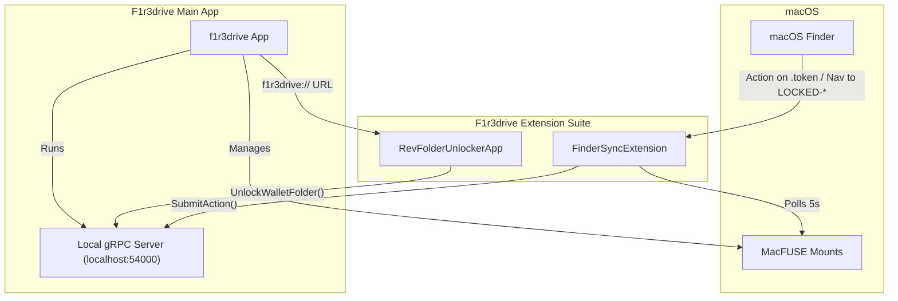

# F1r3drive Extension Architecture

## 1. Components
- **Main App (`f1r3drive`)**: The core application, responsible for MacFUSE mounting and running the local backend.
- **Finder Sync Extension (`FinderSyncExtension`)**: macOS extension for Finder integration (context menus, mount detection).
- **Unlocker UI (`RevFolderUnlockerApp`)**: Standalone SwiftUI application for handling sensitive credentials securely.

## 2. Interaction with Main App (`f1r3drive`)

### A. gRPC IPC (Inter-Process Communication)
The extension suite acts as a client to the Main App's local gRPC server running on `localhost:54000`.
- **Service**: `FinderSyncExtensionService`
- **`SubmitAction(MenuActionRequest)`**: Triggered by the Finder Sync Extension when the "Change" context menu action is clicked on a `.token` file.
- **`UnlockWalletFolder(UnlockWalletFolderRequest)`**: Triggered by `RevFolderUnlockerApp` to validate a private key and unlock a directory.

### B. File System / MacFUSE Integration
- The Main App creates and manages MacFUSE volume mounts.
- `FinderSyncExtension` continuously polls (5-second interval) to detect these MacFUSE mounts.
- Upon detection, the extension binds to the volume, enabling `.token` context menus and intercepting user navigation into `LOCKED-REMOTE-REV-<ADDRESS>` directories.

### C. Deep Linking (URL Scheme)
- **Protocol**: `f1r3drive://`
- **Mechanism**: The Main App (or other clients) can invoke `f1r3drive://unlock?revAddress=<ADDRESS>`.
- **Action**: Launches `RevFolderUnlockerApp` and dynamically populates the unlock interface for the requested address.
